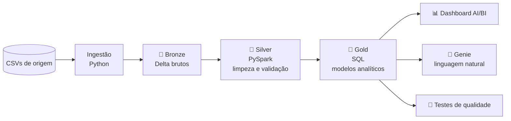
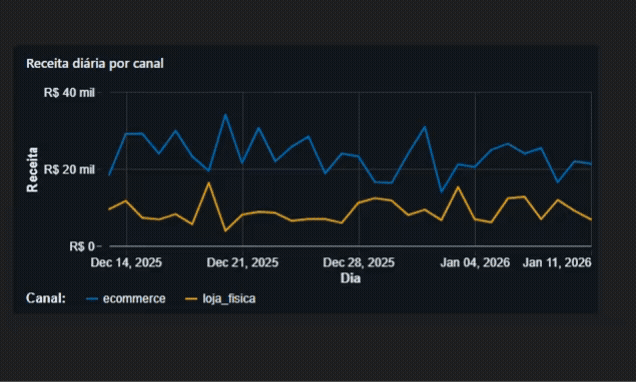

<div align="center">

# 🛒 E-commerce Lakehouse | Databricks

**Plataforma de dados ponta a ponta para e-commerce: da ingestão ao dashboard executivo e consultas em linguagem natural.**


[Visão geral](#visão-geral) · [Arquitetura](#arquitetura) · [Features](#features) · [Demonstração](#demonstração) · [Resultados](#resultados) · [Quick Start](#quick-start) · [Estrutura](#estrutura-do-projeto) · [Autora](#autora)

</div>

---

## Visão geral

Projeto de Engenharia de Dados que simula a plataforma de dados de um e-commerce usando **arquitetura Lakehouse** e o **modelo Medallion (Bronze → Silver → Gold)**. Transforma arquivos CSV brutos em informação confiável para responder perguntas como:

- 💰 Quanto o e-commerce fatura e como as vendas variam ao longo do tempo?
- 👥 Quais clientes geram mais receita e quantos são VIP?
- 🏷️ Como nossos preços se comparam aos de Mercado Livre, Amazon, Magalu e Shopee?
- 🔎 Existem problemas de qualidade nos dados que exigem atenção?

---

## Arquitetura



Orquestração com **Databricks Jobs** (`ingestão → pipeline → testes`) e toda a infraestrutura versionada com **Databricks Asset Bundles**.

---

## Features

- ✅ Arquitetura **Medallion** sobre **Delta Lake** e **Unity Catalog**
- ✅ Transformações em **PySpark** com **Lakeflow Declarative Pipelines**
- ✅ Modelagem analítica em **SQL** (CTEs, window functions, `COUNT DISTINCT`)
- ✅ **Segmentação de clientes** (VIP, TOP_TIER, REGULAR) por receita acumulada
- ✅ **Análise de competitividade de preços** com detecção de preços suspeitos
- ✅ **Suíte de testes automatizados** (schema, integridade, regras de negócio)
- ✅ Tabela de **monitoramento de qualidade de dados**
- ✅ **Dashboard executivo** em Databricks AI/BI (Vendas, Clientes e Preços)
- ✅ **Genie** configurado para perguntas em linguagem natural
- ✅ **Job agendado** (seg-sex, 06:00) e **Infrastructure as Code**

---

## Demonstração

### 📊 Dashboard executivo (Databricks AI/BI)

<p align="center">
  
</p>

Três áreas de análise: **Vendas**, **Clientes** e **Preços**. Mais detalhes na [documentação técnica](docs/TECHNICAL.md#5-dashboard-executivo).


### 🤖 Genie: perguntas em linguagem natural

<p align="center">
  
</p>

- ✅ **12 perguntas de benchmark validadas com 100% de acerto**
- 🔎 Consultas em linguagem natural sobre as 5 tabelas Gold
- 📊 Receita, vendas, clientes, produtos e competitividade de preços
- 📄 Configuração: [`genie/diretoria_ecommerce.geniespace.json`](genie/diretoria_ecommerce.geniespace.json)
- 📚 Regras e exemplos: [`docs/genie.md`](docs/genie.md)

> 💡 No exemplo acima, a resposta de **R$ 705.486,21** é a receita do **canal e-commerce**. A receita total, somando a loja física, é **R$ 974.077,28**.

---

## Resultados

<!-- DICA: adicione aqui um print do dashboard.
 -->

| Indicador | Valor |
|---|---:|
| Clientes | 50 |
| Produtos | 215 |
| Vendas | 3.020 |
| Receita total | R$ 974.077,28 |
| Clientes VIP | 10 (R$ 262.806,22 em receita) |
| Produtos mais caros que todos os concorrentes | 35 de 215 |

**Alertas de qualidade encontrados pelos testes:**

| Situação | Ocorrências |
|---|---:|
| Vendas de produtos não cadastrados | 20 |
| Vendas anteriores ao cadastro do produto | 5 |
| Preços de concorrentes potencialmente suspeitos (< 60% do nosso preço) | 55 |

> 📅 Vendas: 13/12/2025 → 11/01/2026 · Preços de concorrentes: snapshot de 11/01/2026

---

## Camadas de dados

| Camada | O que faz | Destaques |
|---|---|---|
| 🥉 **Bronze** | Ingere os CSVs em tabelas Delta | 4 tabelas, ingestão parametrizada |
| 🥈 **Silver** | Limpa, padroniza e valida | Deduplicação, tipos, regiões por UF, regras de negócio |
| 🥇 **Gold** | Modelos prontos para análise | 6 tabelas: vendas temporais, produtos, clientes, vendas detalhadas, competitividade e qualidade |

Detalhes de cada tabela, regras e decisões em **[docs/TECHNICAL.md](docs/TECHNICAL.md)**.

---

## Quick Start

**Pré-requisitos:** workspace Databricks com Unity Catalog e [Databricks CLI](https://docs.databricks.com/dev-tools/cli/) instalado.

```bash
# 1. Clonar o repositório
git clone https://github.com/Jessica-Fuentess/Projeto_Ecommerce_Databricks.git
cd Projeto_Ecommerce_Databricks

# 2. Autenticar no workspace
databricks auth login --host https://<seu-workspace>.cloud.databricks.com

# 3. Validar e implantar o bundle (pipeline, job, dashboard e Genie)
databricks bundle validate
databricks bundle deploy

# 4. Executar o fluxo completo (ingestão → pipeline → testes)
databricks bundle run job_lakehouse_diario
```

> O agendamento do job está **PAUSED** por ser um projeto de portfólio.

---

## Estrutura do projeto

```text
Projeto_Ecommerce_Databricks/
├── data/                  # CSVs de origem
├── src/
│   ├── bronze/            # ingestão (ingest.py, schema)
│   ├── silver/            # PySpark: clientes, produtos, vendas, concorrentes
│   └── gold/              # SQL: modelos analíticos
├── tests/                 # testes_qualidade.py
├── dashboards/            # dashboard AI/BI (.lvdash.json)
├── genie/                 # configuração do Genie space
├── docs/                  # TECHNICAL.md, architecture.md, genie.md, dashboard-demo.gif, genie-demo.gif
├── resources/             # jobs.yml, pipeline.yml, dashboards.yml, genie.yml
└── databricks.yml         # Databricks Asset Bundle
```

---

## Próximos passos

- [ ] Histórico diário de preços dos concorrentes
- [ ] Análises de retenção e recorrência de clientes
- [ ] Novos canais de venda e novos períodos de dados
- [ ] Ingestão a partir de fontes externas

---

## Autora

<div align="center">

**Jéssica Fuentes** · Analista de Dados | Business Intelligence

15+ anos em Comércio Exterior, Logística e Operações, agora aplicando essa visão de negócio em Dados e BI.

[](https://www.linkedin.com/in/j%C3%A9ssica-fuentes/)
[](https://github.com/Jessica-Fuentess)

`SQL` · `Power BI` · `Python` · `PySpark` · `Databricks` · `Excel` · `Git`

⭐ Gostou do projeto? Deixe uma estrela no repositório!

</div>
